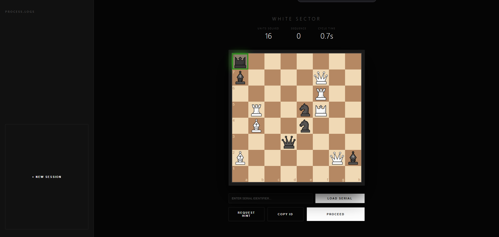
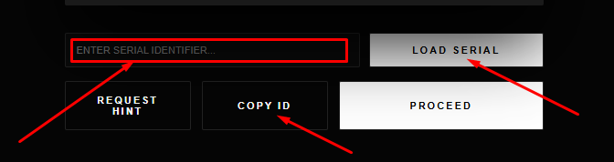
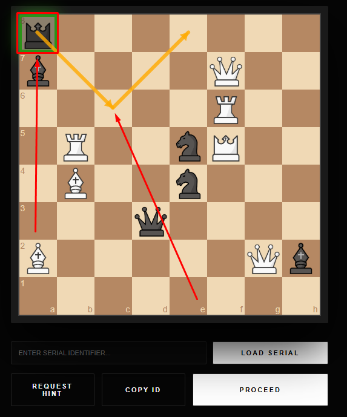
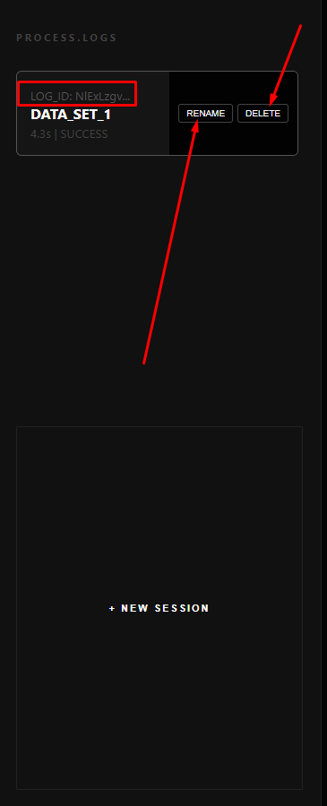

# ♟️ Chess Puzzle - Stealth Serial Loader
> A high-performance Chess puzzle generator and loader built with Flask and Chess.js.

<p align="center">
  
</p>

---

## 🚀 About The Project
This project is a web-based chess application designed to generate "Mate in One" puzzles. It features a stealth serial system that allows users to encode/decode board positions using Base64 identifiers.

**Key Features:**
* **Auto-Generation:** Instantly create unique "Mate in One" puzzles.
* **Serial System:** Share puzzles easily using unique serial codes.
<p align="center">
  
</p>
* **Visual Assistance:** Integrated hint system and legal move highlighting.
<p align="center">
  
</p>
* **Persistence:** Save your progress and history in local storage.
<p align="center">
  
</p>
---

## 🛠️ Built With
* **Backend:** [Flask](https://flask.palletsprojects.com/) (Python)
* **Frontend:** HTML5, CSS3, JavaScript (jQuery)
* **Chess Logic:** [python-chess](https://python-chess.readthedocs.io/) & [chess.js](https://github.com/jhlywa/chess.js)
* **Board UI:** [chessboard.js](https://chessboardjs.com/)

---

## ⚙️ Installation

1. **Clone the repo:**
   ```bash
   git clone [https://github.com/your-username/chess-puzzle.git](https://github.com/your-username/chess-puzzle.git)